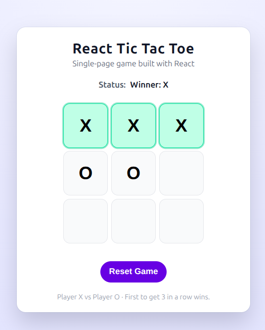

# React Tic Tac Toe 🎮

A clean, single-page Tic Tac Toe game built with **React**.  
Play as X and O locally in your browser, with automatic winner detection and a reset button.

---

## 🚀 Demo


---

## ✨ Features

- Single-page React application (no routing)
- 3x3 Tic Tac Toe board
- Highlights the winning combination
- Detects draws
- Shows whose turn it is (X or O)
- Reset button to start a new game
- Responsive and minimal UI

---

## 🧱 Tech Stack

- [React](https://react.dev/)
- JavaScript (ES6+)
- CSS (no UI framework)

---

## 📂 Project Structure

```text
react-tic-tac-toe/
├─ src/
│  ├─ App.js        # Main game logic & UI
│  ├─ App.css       # Component styles
│  ├─ index.js      # React entry point
│  └─ index.css     # Global styles
├─ package.json
└─ README.md

---

## 🕹️ How to Play

1. Player **X** goes first.
2. Click an empty square to place a mark.
3. First to get **3 in a row** wins.
4. If the board is full and nobody wins → **Draw**.
5. Click **Reset Game** to start over.

---

## 🛠️ Getting Started

### Prerequisites

Install Node.js (LTS recommended):  
https://nodejs.org/

### Install & Run

```bash
cd react-tic-tac-toe
npm install
npm start

The app will reload automatically when you edit any file.

Building for production
npm run build
# or
yarn build


This creates an optimized production build in the build/ folder.
